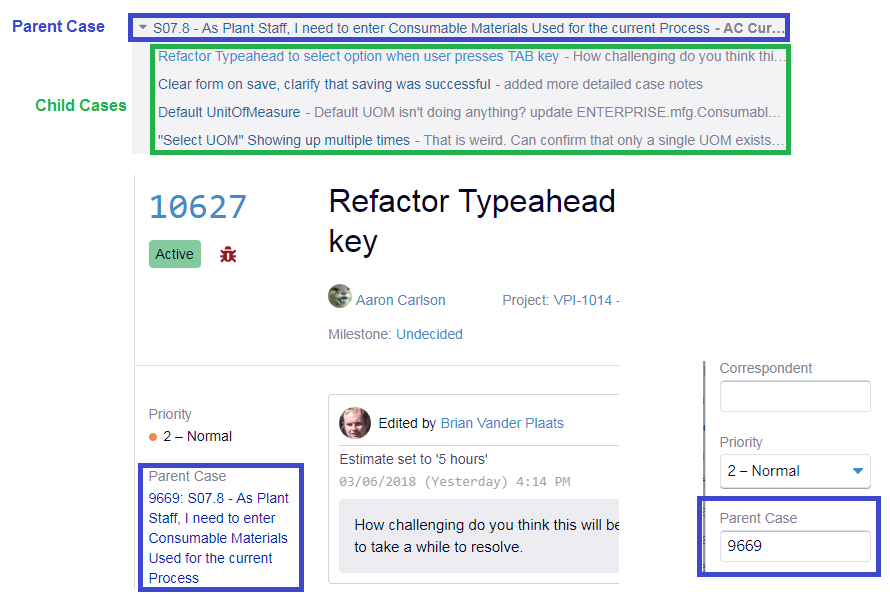
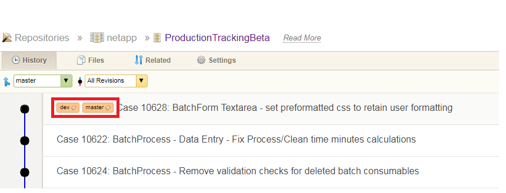
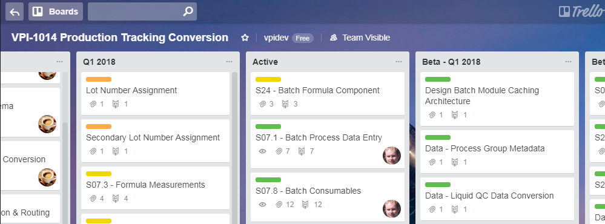
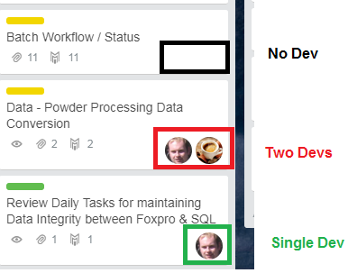

# project-developer-policy

This document details expecations regarding how each project developer conducts their work.  Many of these are general good development practices, and some are expectations specific to vpidev.  

## Table of Contents

1. [Onboarding](#onboarding)
2. [Case Management](#case-management)
3. [Time Accounting](#time-accounting)
4. [Build Systems and Code Respositories](#build-systems-and-code-respositories)
5. [Daily Standup](#daily-standup)
6. [Daily Tasks](#daily-tasks)
7. [Weekly Goals](#weekly-goals)
8. [Sprints](#sprints)
9. [Project Schedule / Backlog](#project-schedule-backlog)
10. [Change Management](#change-management)
11. [New Tools and Technology](#new-tools-and-technology)
12. [Communication](#Communication)

## Onboarding

TBD

## Case Management

We currently use Manuscript/Fogbugz for all project work, where each work item assigned a Case / Case #

###### [Style [A000](#style-a000)]

### All cases must be linked to the correct project

*Why?*: need to have visibility and accounting of work against a project

###### [Style [A000](#style-a000)]

### All cases must have a time estimate

*Why?*: required for logging time against a case

*Why?*: There should be some sense of scope to a case - estimate can always be changed later

###### [Style [A000](#style-a000)]

### All cases must be linked to a relevant parent case if available

*Why?*: For larger projects with hundreds of cases, parent cases are important to keep things organized

###### [Style [A000](#style-a000)]

### All bug cases must include necessary steps to reproduce (repro) - or else clearly indicate that there is an issue, but intermittant and not easily reproducible.   
- Screenshots
- URL Links
- Error Message Text
- repro steps

*Why?*: Many kinds of bugs are highly reproducible, but the exact order of steps is often important - leaving these out may lead a developer to conclude the issue is not reproducible, when in fact it is.

 

###### [Style [A000](#style-a000)]

### User story cases must follow the standard user story format - As `<blank>` I need to `<blank>`

*Why?*: This is the definition of a user story.  anything else is a feature/request/schedule item

###### [Style [A000](#style-a000)]

### All cases must have a set of actionable, measurable goals, typically in the form of acceptance criteria.   If these are not available, the work should be considered in need of design.  

*Why?*: Without specific goals/objectives, there is nothing to evaluate/test against when the work is "done"

*Why?*: The work estimate should reflect work items - this cannot be accurate if those goals are not defined. 

*Why?*: There is never perfect communication between end user, proejct manager, and the developer.  Stating goals explicity makes miscommunication more difficult

*Why?*: It is much cheaper to spend time up-front reviewing plans, designs then to realize a mistake or issue once coding work is in process.  

*Why?*: Scope on any item can be volatile - being specific about what should be achieved allows the developer/project manager take new information/changes and decide if they are truly part of the immediate goals, or if they should be part of a new/future case.

*Why?*: Save time when reviewing - the project manager won't spend time looking for a change if it is explicitly stated it won't be implemented yet!

###### [Style [A000](#style-a000)]

### Resolved cases must be linked to a work product, which can include one or more of the following

    - One or more commits (linked to kiln)
    - a database script
    - An email explaining a solution to an end user
    - design notes & conclusions

*Why?*: Case history is not complete with out reference to what was produced.

*Why?*: details are quickly forgotten by the developer

*Why?*: a "closed" case can be re-opened at any time - past notes serve as a starting point

###### [Style [A000](#style-a000)]

### Developer must test all changes on dev before resolving a case

 Additionally, developer must post results of such a test in the case
    - Screenshots
    - Outputs (query results, excel files)

*Why?*: Many bugs are found quickly after running on the dev system - in this case, it is much better for the dev to discover this quickly rather than wait hours or days for the PM to find them and report back

*Why?*: By posting documented results, the PM or other developer wanting to try the fix/change can use different inputs, rather than repeat the exact same test (which would tell us nothing and is a waste of time)

## Time Accounting

###### [Style [A000](#style-a000)]

### All project time should be logged against a relevant case

*Why?*: Enables tracking project cost (time)

*Why?*: Enables evaluation of developer focus (esp for developers engaged in multiple projects and/or support work)

*Why?*: Evaluate time spent on feature vs estimate / feature priority

*Why?*: Compare hours billed vs. worked for Contract Staff

###### [Style [A000](#style-a000)]

### Developers must reconcile timesheets on a weekly, preferrably daily basis

*Why?*: Prevent hours overflow (Fogbugz keeps the clock running until it is stopped)

*Why?*: Fix mistakes (e.g. recorded against wrong case)

## Build Systems and Code Respositories

###### [Style [A000](#style-a000)]

### Developers must build / compile changes on local systems before building

*Why?*: prevents simple regressions from ever touching the shared dev/staging servers

*Why?*: helps avoid scenarios where bad changes are mixed in with goods changes in highly active repositories

###### [Style [A000](#style-a000)]

### Developers must move the bookmark to `dev` after pushing change to kiln.   

*Why?*: Not all build failures are apparent when building locally, for various reasons.  If the build would fail on the dev server, moving the bookmark will alert the development team as soon as possible, rather than hours or days later

*Why?*: Developers must test all of their changes on the dev server after pushing to the dev branch.  Failing to move the dev bookmark means that either this did not happen, or the developer tested against the wrong commit - both of which are bad!

## Daily Standup

###### [Style [A000](#style-a000)]

### Developer must particpate in the daily standup

*Why?*: low-friction way to broadcast status to all project members

*Why?*: communicate issues that may spur additional communication / discussion

###### [Style [A000](#style-a000)]

### Daily Standup Should use the following format:

1. What did I do yesterday?
2. What am I doing today?
3. What are my blockers?

A few additional comments.

- Include Case # numbers
- indicate if you started, continued, or finished a work item
- Do not just say "continue to work on feature X" - give some level of detail - even if it's the next item you will implement following the standup e.g. "Add validation to form"

*Why?*: This is a standard format that helps the developer frame their current work. 

*Why?*:Understanding blockers is important.  Is someone waiting on a review?  Do we need a schema change?  

###### [Style [A000](#style-a000)]

### Daily Standup will take place in a shared chat group / channel

*Why?*: simpler than all users joining a group call

*Why?*: generates a written record of what was discussed

*Why?*: not all daily communication is necessary - a quick glance by project members may be enough.

*Why?*: The real value in the standup process for the individual - making a daily plan

*Why?*: Verbal standups often jump right into discussion, which is not the purpose of the standup.  

###### [Style [A000](#style-a000)]

### Daily standups should be posted within the first 15-30 minutes of when your day begins

*Why?*: Planning your day has the most value in the morning

*Why?*: Do not want to spend too much time planning your day.  

## Daily Tasks 

###### [Style [A000](#style-a000)]

### The primary goal each day is to work on project items according to your assigned work times and project allocation. 

- contract developers generally have 100% of their time allocated to the current project.  
- full-time developers involved with support work or other projects will have variable project time allocations, and it is very important that these allocations are met!

*Why?*: Need to understand if actual project hours changes, for any reason

###### [Style [A000](#style-a000)]

### Each day should output a number of visible work products for the project

Work products can take many forms:

- New Cases
- Close Cases
- Emails
- Meetings
- Phone Calls
- Commits
- Documentation (inside of cases or in other media)

Each developer is responsible for producing a reasonable amount of work product each day, and in a form that can be reviewed or evaluated

*Why?*: Hours worked is not enough - There needs to be daily accomplishments

*Why?*: Lack of output is an important management concern - Are there distractions?  Is the work unclear?  Are there unresolved blockers?

## Weekly Goals 

###### [Style [A000](#style-a000)]

### Each developer must have a full stack of work each week - any gaps should be reviewed with the project manager ASAP

*Why?*: Project manager must make sure all resources are fully enganged at all times.  This is especially important for contract developers because they do not have a backlog of support work to occupy them

##  Sprints

As of 3/7/18, use of bi-weekly sprints has tapered off in the past several months.  We will likely use these again in the future, so this section is a placeholder for sprint guidelines

## Project Schedule Backlog

###### [Style [A000](#style-a000)]

### Master Project Schedule managed on Trello board

We currently use a Trello board, integrated with Manuscript, for project scheduling.  

*Why?*: Good for a high level view of project stats

*Why?*: Integrates with cases to show detail without cluttering schedule (50-100 cards vs 500-1000 cases)

*Why?*: Easy to shift priorities

###### [Style [A000](#style-a000)]
### Each developer must tag / follow the trello card related to their current case

(can follow a card by simply hitting spacebar)

Likewise, when developer is no longer working on said card, they must unfollow that card

*Why?*: provides visibility at project level what project members are working on.  

###### [Style [A000](#style-a000)]
### Developers must add new cases to cards they are working on

*Why?*: Provide visibility to current card

*Why?*: Trello doesn't automatically add child cases

## Change Management

###### [Style [A000](#style-a000)]

### Changes that increase case / feature / module scope must be documented & include updated estimates

*Why?*: Need visibility that scope is increasing, which will cause some degree of schedule slip (assuming other priorities do not change)

*Why?*: Simply spending more time on a task without properly assessing is a poor development practice - it allows for a very undiscplined approach to development

###### [Style [A000](#style-a000)]

### Scope / Time changes must be communicated with the project manager. 

Minor changes (say 5-10 hours) can be communicated in the daily standup, but others should be a discussion.  

*Why?*: For large scope changes, project manager and/or stakeholders may decide that doing X is not worth it.  

*Why?*: Project manager may need to adjust/move items around the schedule to deal with the new reality

## New Tools and Technology

###### [Style [A000](#style-a000)]

### Research should be limited to the task at hand, unless otherwise noted.   

*Why?*: General research is not considered project time unless directly connected to the project.  

###### [Style [A000](#style-a000)]

### Any new technique or tool not already in use on the project should be communicated with the rest of the project team. 

could be a wide variety of things

- a new tool Postman
- a new JS Library e.g. Lodash
- using a function of an existing tool that hasn't been used before 

*Why?*: developer making the change needs to justify why said tool/technique is useful/needs to be used

*Why?*: Make sure that we are using tools consistently (e.g. one date picker style)

### New tools / techniques should be extensively documented in the case

 - code examples
 - links to articles
 - working samples e.g. JSFiddle

 *Why?*: Need to demonstrate understanding of technique/tool

 *Why?*: Prevent hasty/sloppy adoption of technique

## Communication

###### [Style [A000](#style-a000)]

### Use Hipchat group discussions as preferred communication tool

*Why?*: Your question/issue may be resolved faster if multiple people see it

*Why?*: shared awareness of things going on in the project

###### [Style [A000](#style-a000)]

### Use proper channels for topics

*Why?*: Reduce channel noise

###### [Style [A000](#style-a000)]

### Use Hipchat person-person messsages over email

*Why?*: Hipchat is a more reliable way to get ahold of someone - email is less immediate

*Why?*: message in email create clutter in everyones inbox 

